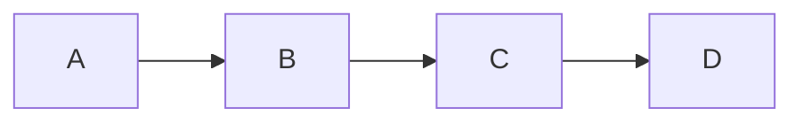
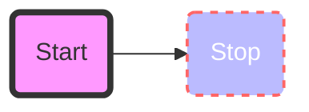

# Obisidian


## Mermaid

### Links



### Styling mermaid


# Plugins


# Remotely Save


# Dataview

## Metadata

> Write in every file
> 

---
note-written: in-progress
type: software
subject: Webdev

---

### Dataview Query language 
```dataview
table type as "Type", note-written, subject
where contains(type,"podcast")
```


## Excalidraw


![[Excalidraw/Obsidian Help]]


