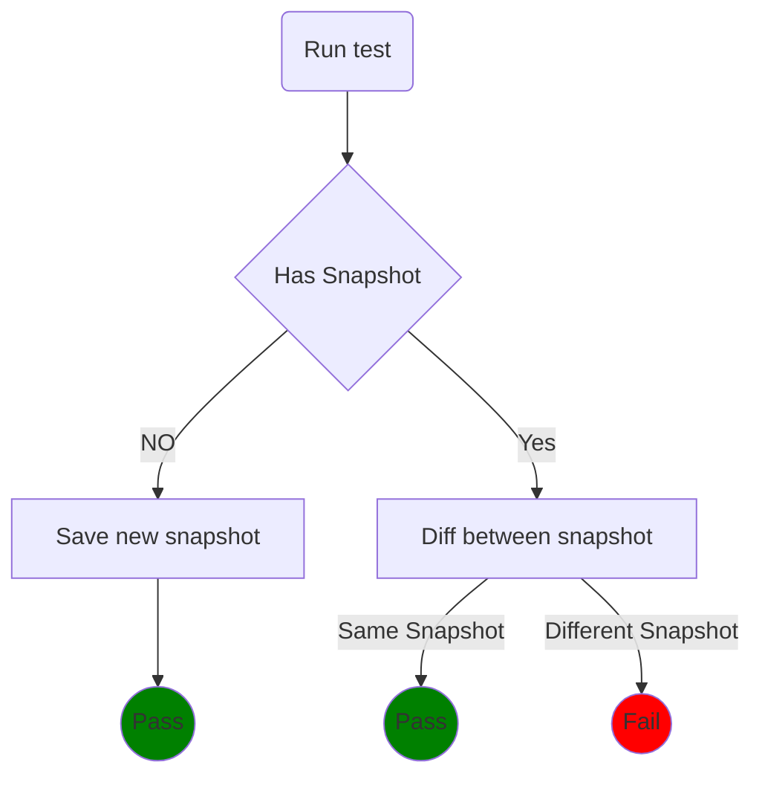

#testing #uitesting #snapshot-testing

## What is Snapshot testing

```mermaid
graph TD  
Runtest(Run test) --> HasSnapShot{Has Snapshot}
HasSnapShot-->|NO|SNS[Save new snapshot]
HasSnapShot-->|Yes|DIFFS[Diff between snapshot]
SNS --> PassSNS((Pass))
DIFFS -->|Same Snapshot|PassDiff((Pass))
DIFFS -->|Different Snapshot|FailDiff((Fail))

style FailDiff fill:red;
style PassDiff fill:green;
style PassSNS fill:green;

```
# Cool, let's see some code

> Example with React, Jest, React testing library
## Install

## Setup

